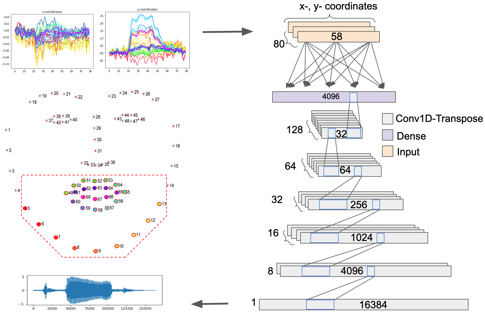

# VowSynth

train* : These files reads in input data, trains the network and save the generated test files.

audio_features: These files are used to compute WER on the train/test data. The file train an ASR on the groundtruth data and then evaluates the generated tokens.

run_metrics: These files are used to compute STOI/PESQ and MCD scores of the generated data.

